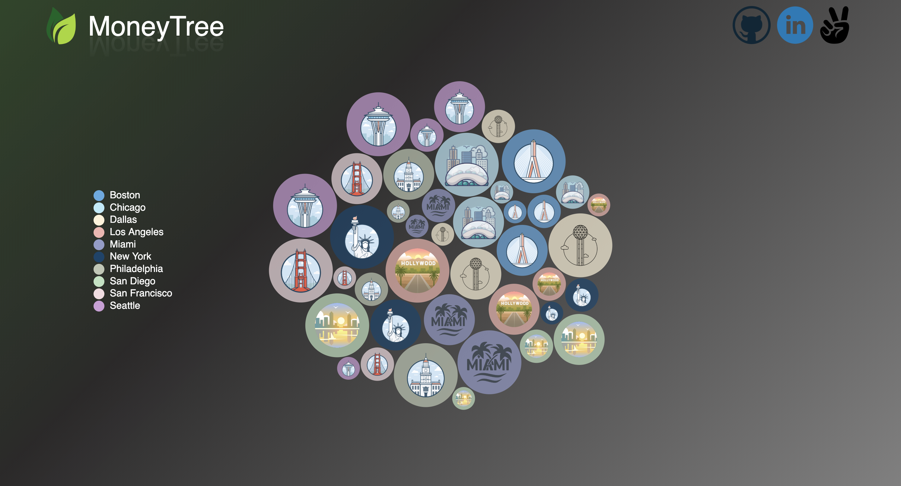

# README

# MoneyTree

[MoneyTree Live](https://chrisdangnguyen.github.io/moneytree/)

## Background

MoneyTree is an appealing data visualization website that inform users of average software engineer salaries for multiple levels across popular metropolitan cities in the United States. User will have the experience to easily access and retrieve information through a click of a few buttons. 

## Technologies

* Javascript 
* HTML 
* CSS
* D3.js

## Features

* Select a bubble and it will enlarge with information
* Dragging the bubble around will displace bubbles around but it'll all tie back together 
* Upon further clicking, user will be taken to the website for more specific breakdown of the location and salary

## Future Development
